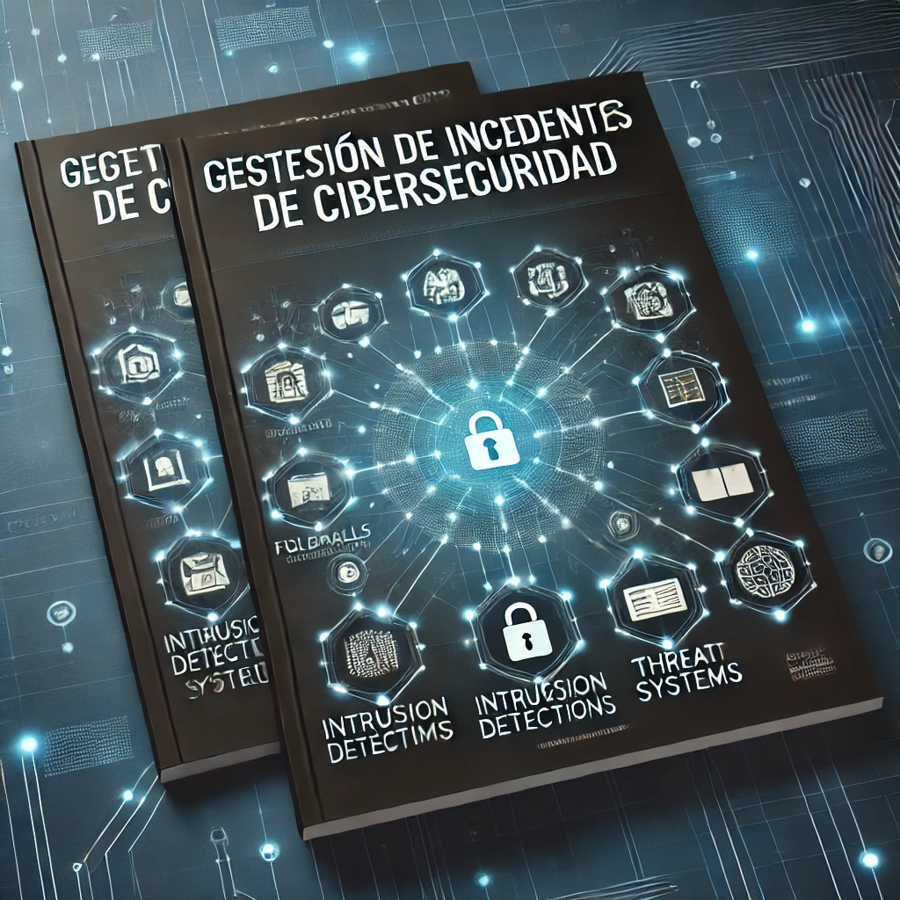

# Conceptos Clave en la Gestión de Incidentes de Ciberseguridad

# Índice

- [SOC: Centro de Operaciones de Seguridad](#soc-centro-de-operaciones-de-seguridad)
- [Principales Componentes de un SOC](#principales-componentes-de-un-soc)
- [CSIRT, CERT y CIRT](#csirt-cert-y-cirt)
- [SIEM, SOAR, IDS, IPS](#siem-soar-ids-ips)
    - [SIEM (Security Information and Event Management)](#siem-security-information-and-event-management)
        - [Principales Funcionalidades](#principales-funcionalidades)
        - [Principales Productos en el Mercado](#principales-productos-en-el-mercado)
    - [SOAR (Security Orchestration, Automation, and Response)](#soar-security-orchestration-automation-and-response)
        - [Principales Funcionalidades](#principales-funcionalidades)
        - [Principales Productos en el Mercado](#principales-productos-en-el-mercado)
    - [IDS (Intrusion Detection System)](#ids-intrusion-detection-system)
        - [Principales Funcionalidades](#principales-funcionalidades)
        - [Principales Productos en el Mercado](#principales-productos-en-el-mercado)
    - [IPS (Intrusion Prevention System)](#ips-intrusion-prevention-system)
        - [Principales Funcionalidades](#principales-funcionalidades)
        - [Principales Productos en el Mercado](#principales-productos-en-el-mercado)
- [Threat Intelligence, Threat Hunting, Incident Response, Forensics](#threat-intelligence-threat-hunting-incident-response-forensics)
    - [Threat Intelligence](#threat-intelligence)
    - [Threat Hunting](#threat-hunting)
    - [Incident Response](#incident-response)
    - [Forensics](#forensics)
- [Casos Prácticos](#casos-practicos)
    - [Caso Hipotético: Compromiso de una Cuenta de Usuario](#caso-hipotético-compromiso-de-una-cuenta-de-usuario)

# **SOC: Centro de Operaciones de Seguridad**

Un Centro de Operaciones de Seguridad es una unidad centralizada que monitorea, detecta, investiga y responde a incidentes de ciberseguridad en tiempo real. Su principal objetivo es proteger la infraestructura de TI de una organización, garantizando la continuidad del negocio y minimizando los riesgos asociados con las amenazas cibernéticas. Está compuesto por un equipo de expertos en seguridad que trabajan de manera coordinada utilizando una variedad de herramientas y procesos estructurados. Además de la detección y respuesta a incidentes, también se encarga de la prevención de amenazas, el cumplimiento normativo, y la mejora continua de las estrategias de seguridad.

## **Principales Componentes de un SOC**
| Personal |  |
| :---- | :---- |
| Analistas de seguridad | Su función principal es monitorear alertas, analizar eventos, y responder a incidentes. Generalmente, se dividen en 3 niveles según su experiencia y habilidades. Los de nivel 1 se encargan de la monitorización inicial de alertas, mientras que los de nivel 3 manejan incidentes complejos. |
| Ingenieros de seguridad | Mantienen y optimizan las herramientas y tecnologías del SOC. Además, se encargan de diseñar, implementar y mantener la infraestructura de seguridad del SOC. Entre sus tareas se encuentran configurar y optimizar sistemas como SIEM, SOAR, IDS/IPS, y asegurar que las herramientas estén actualizadas y funcionando de manera efectiva. |
| Líderes del SOC | Gestionan la operación diaria del SOC, asegurando la alineación de las actividades con los objetivos estratégicos de la organización. Además, proporcionan informes a la alta dirección. También se pueden encargar de gestionar proyectos de mejora y a su vez mantienen la comunicación con otras áreas de la empresa. |

---

| Herramientas y Tecnologías |  |
| :---- | :---- |
| SIEM (Security Information and Event Management) | Esta herramienta recopila datos de logs de diversas fuentes y los correlaciona para identificar patrones sospechosos o indicadores de compromiso. Nos proporciona una vista centralizada de la seguridad, facilitando el cumplimiento normativo y mejorando la capacidad de respuesta. |
| SOAR (Security Orchestration, Automation, and Response) | Automatiza algunos procesos repetitivos como la recopilación de datos y ejecución de scripts, reduciendo el tiempo de respuesta a incidentes. Mejora la eficiencia del SOC, permitiendo así a los analistas centrarse en tareas más complejas, reduciendo el tiempo de resolución de incidentes. |
| IDS/IPS (Intrusion Detection System/Intrusion Prevention System) | El IDS detecta y alerta sobre actividades sospechosas, mientras que el IPS actúa para prevenir intrusiones bloqueando el tráfico malicioso. Pueden ser basados en red (NIDS/NIPS) o en host (HIDS/HIPS), dependiendo de dónde se desplieguen. |

---

| Procesos |  |
| :---- | :---- |
| Monitoreo continuo | La vigilancia constante es crucial para detectar amenazas en tiempo real. Se pueden utilizar herramientas como SIEM para monitorizar eventos 24/7. Su objetivo es asegurar que cualquier actividad anómala sea detectada y manejada rápidamente para minimizar el impacto |
| Gestión de incidentes | Tiene una serie de fases que son detección, análisis, contención, erradicación, recuperación y lecciones aprendidas. |
| Análisis forense | Profundiza en el análisis post-incident para entender cómo ocurrió un incidente, qué sistemas fueron afectados, y qué medidas se deben tomar para evitar futuras ocurrencias. Algunas de sus técnicas pueden ser la recopilación de evidencias digitales, análisis de logs, y recuperación de datos borrados o manipulados. |

---

 
 

# **CSIRT, CERT y CIRT**

El **CSIRT (Computer Security Incident Response Team)** es un equipo dedicado a manejar incidentes de seguridad cibernética, proporcionando una respuesta rápida y eficaz para mitigar los efectos de cualquier amenaza detectada.   
Por ejemplo: CSIRT de BBVA.

El **CERT (Computer Emergency Response Team)** por su parte cumple una función similar, pero su alcance generalmente es más amplio, estando usualmente establecido a nivel nacional o sectorial para responder a emergencias cibernéticas y apoyar a múltiples organizaciones dentro de un sector específico.  
Por ejemplo: INCIBE-CERT.

Por otro lado el **CIRT (Cyber Incident Response Team)** es otra denominación utilizada para referirse a un equipo de respuesta a incidentes, enfocándose principalmente en la ciberseguridad y manejando amenazas específicas que afectan a la infraestructura digital de una organización.  
Por ejemplo: CIRT de Telefónica.

A pesar de sus diferentes denominaciones, estos equipos comparten varias similitudes clave. Para empezar, todos ellos están centrados en la respuesta a incidentes de seguridad, ofreciendo asistencia técnica y coordinando esfuerzos durante los incidentes para minimizar el impacto. Además, se dedican a la investigación y análisis de las amenazas para mitigar los riesgos y prevenir futuros ataques.

Sin embargo, existen diferencias importantes en cuanto a su ámbito de actuación y enfoque. Los **CERT** suelen operar en un nivel más amplio, nacional o sectorial, y su enfoque está más orientado a la prevención y educación, fomentando la concienciación sobre la seguridad cibernética y promoviendo mejores prácticas entre las organizaciones. En cambio, los **CSIRT** y **CIRT** son generalmente internos a una organización específica y están más orientados a la respuesta operativa, centrándose en la detección rápida, contención y mitigación de incidentes a medida que ocurren.

 
 

# **SIEM, SOAR, IDS, IPS**

## **SIEM (Security Information and Event Management)**

Es una plataforma que recopila, analiza y correlaciona datos de seguridad de diversas fuentes para detectar amenazas en tiempo real, generar alertas y facilitar la gestión de logs y cumplimiento normativo.

### **Principales Funcionalidades**

- **Correlación de eventos:** Permite identificar patrones de comportamiento sospechosos correlacionando eventos provenientes de diferentes fuentes.  
- **Monitoreo en tiempo real:** Proporciona visibilidad sobre el estado de la seguridad en la red y genera alertas de inmediato ante actividades inusuales.  
- **Generación de informes:** Facilita la creación de informes detallados para auditorías y cumplimiento normativo.

### **Principales Productos en el Mercado**

- **Splunk:** Es una de las plataformas más populares, es conocida por su capacidad para analizar grandes volúmenes de datos en tiempo real y generar informes detallados. Ofrece funciones avanzadas de análisis de seguridad, visualización y creación de alertas.  
    
- **IBM QRadar:** Se trata de un SIEM robusto que permite la correlación de eventos y la integración de diferentes tecnologías de seguridad. Es ampliamente utilizado por su capacidad para gestionar grandes cantidades de datos y su fácil integración con otras soluciones de seguridad.  
    
- **ArcSight (Micro Focus):** Ofrece una serie de análisis de eventos de seguridad y gestión de logs a gran escala, es ideal para empresas grandes y complejas. Además, proporciona una potente capacidad de correlación y monitorización en tiempo real.

 

## **SOAR (Security Orchestration, Automation, and Response)**

Son plataformas que automatizan tareas repetitivas en la gestión de incidentes de seguridad, coordinando las respuestas ante incidentes y mejorando la eficiencia operativa mediante la integración de herramientas de seguridad.

### **Principales Funcionalidades**

- **Automatización de flujos de trabajo:** Ejecución automática de tareas predefinidas basadas en incidentes específicos, como bloquear una IP o detener un servicio comprometido.  
- **Orquestación de herramientas de seguridad:** Conecta y coordina diferentes tecnologías para una respuesta unificada.  
- **Mejora de la eficiencia operativa:** Reduce el tiempo y esfuerzo manual en la resolución de incidentes.

### **Principales Productos en el Mercado**

- **Palo Alto Networks Cortex XSOAR:** Proporciona automatización de flujos de trabajo y orquestación para gestionar incidentes de manera más eficiente. A su vez, se integra con múltiples tecnologías de seguridad y permite crear respuestas personalizadas.  
    
- **IBM Resilient:** Ofrece capacidades de automatización y orquestación para gestionar la respuesta ante incidentes. Además, facilita la coordinación de equipos y la implementación de políticas de respuesta, mejorando la eficiencia operativa.  
    
- **Splunk Phantom:** Es una plataforma que permite orquestar, automatizar y responder a incidentes de seguridad. También ayuda a reducir los tiempos de respuesta mediante la integración con otras soluciones de seguridad.

 

## **IDS (Intrusion Detection System)**

Es un sistema que monitorea el tráfico de red en busca de actividades sospechosas, detectando intrusiones y generando alertas para que el equipo de seguridad tome medidas.

### **Principales Funcionalidades**

- **Monitoreo de tráfico de red o sistemas:** Analiza el tráfico de red o las actividades del sistema en busca de patrones anómalos.  
- **Generación de alertas:** Informa al equipo de seguridad sobre comportamientos que podrían ser indicativos de un ataque.  
- **Detección basada en firmas o anomalías:** Utiliza firmas conocidas (como patrones de malware) o análisis de comportamiento para identificar intrusiones.

### **Principales Productos en el Mercado**

- **Snort:** Es un IDS de código abierto ampliamente utilizado, conocido por su flexibilidad y su capacidad para detectar intrusiones en tiempo real mediante firmas de ataque.  
    
- **Suricata:** Se trata de un IDS de código abierto que ofrece detección de intrusiones, análisis de tráfico y captura de paquetes. Es una alternativa popular a Snort, conocida por su alto rendimiento y su capacidad para manejar grandes volúmenes de datos.  
- **Cisco IDS:** Consiste en un producto de Cisco que proporciona detección de intrusiones en tiempo real. Está diseñado para integrarse de manera eficiente con otros sistemas de seguridad y soluciones de red de Cisco.

 

## **IPS (Intrusion Prevention System)**

Se trata de una tecnología que no solo detecta amenazas, sino que también las previene, bloqueando automáticamente el tráfico malicioso en tiempo real para evitar que los ataques lleguen a sus objetivos.

### **Principales Funcionalidades**

- **Prevención activa de intrusiones:** Bloquea automáticamente el tráfico malicioso, evitando que los ataques lleguen a su destino.  
- **Detección en tiempo real:** Monitorea el tráfico de red y responde de forma inmediata para prevenir compromisos de seguridad.  
- **Análisis basado en firmas y anomalías:** Al igual que un IDS, el IPS utiliza firmas conocidas de ataques y análisis de comportamiento para detectar y prevenir intrusiones.

### **Principales Productos en el Mercado**

- **Cisco Firepower:** Una plataforma que combina capacidades de firewall y IPS, proporcionando protección avanzada contra intrusiones, así como funciones de análisis de tráfico y prevención de amenazas en tiempo real.  
    
- **Palo Alto Networks IPS:** Parte de la suite de seguridad de Palo Alto, con capacidades avanzadas de IPS, firewall y detección de amenazas. Es muy eficaz en la protección contra intrusiones en redes complejas.  
    
- **Fortinet FortiGate:** Solución que incluye IPS como parte de su firewall de próxima generación, ofreciendo prevención activa de intrusiones junto con otros servicios de seguridad como VPN y filtrado web.

# **Threat Intelligence, Threat Hunting, Incident Response, Forensics**

## **Threat Intelligence**

La inteligencia de amenazas es la información procesable sobre amenazas cibernéticas que permite a las organizaciones anticiparse a ataques y mitigar riesgos. Esta información incluye detalles sobre tácticas, técnicas y procedimientos (TTPs) utilizados por los atacantes.

Es utilizada por **SOC** y **CSIRT** para anticiparse a amenazas inminentes y mejorar la postura de seguridad. Proporciona datos valiosos sobre posibles actores de amenazas y sus métodos, permitiendo que las organizaciones tomen medidas preventivas.

## **Threat Hunting**

Threat Hunting es el proceso proactivo de buscar amenazas avanzadas (APT) que pueden haber eludido las soluciones de seguridad tradicionales, como los antivirus y firewalls. Involucra la búsqueda activa de indicadores de compromiso (IOCs) en la red.

Se realiza principalmente por analistas en **SOC** y está dirigido a identificar amenazas que ya han penetrado la red pero no han sido detectadas. Este proceso busca señales de actividad maliciosa de forma proactiva, más allá de las alertas automatizadas.

## **Incident Response**

La respuesta a incidentes es el proceso de manejar un incidente de seguridad cibernética desde su detección hasta su resolución. Esto incluye la identificación, contención, erradicación y recuperación del incidente.

En un **SOC**, el proceso de respuesta a incidentes sigue una serie de pasos estructurados, desde la identificación y contención hasta la investigación y restauración del sistema afectado, minimizando el impacto del incidente.

## **Forensics**

Forensics o análisis forense digital es el proceso de investigar incidentes de seguridad para comprender su alcance y origen. Involucra la recopilación de evidencia digital y el análisis de los datos para reconstruir los eventos y determinar cómo ocurrió un ataque.  
Se utiliza en **SOC** y **CSIRT** durante y después de un incidente para entender su naturaleza, cómo se produjo, qué sistemas fueron afectados y cómo se puede prevenir en el futuro.

 

# **Casos Prácticos**

## **Caso Hipotético: Compromiso de una Cuenta de Usuario**

**Incidente:** Un usuario reporta actividad sospechosa en su cuenta corporativa.

**Uso de Herramientas y Conceptos:**

- **SOC:** Detecta el comportamiento anómalo mediante SIEM y genera una alerta.

- **SIEM:** Correlaciona datos de acceso y detecta múltiples intentos fallidos de inicio de sesión.

- **SOAR:** Automatiza la respuesta inicial, como bloquear la cuenta comprometida.

- **CSIRT:** Inicia la investigación del incidente, identificando el vector de ataque.

- **Threat Intelligence:** Proporciona información sobre tácticas y herramientas utilizadas por el atacante.

- **Threat Hunting:** Analistas buscan evidencia de movimientos laterales en la red.

- **Incident Response:** Se lleva a cabo la contención del incidente, asegurando los sistemas afectados.

- **Forensics:** Realiza un análisis detallado para determinar el alcance del compromiso y las medidas correctivas necesarias.